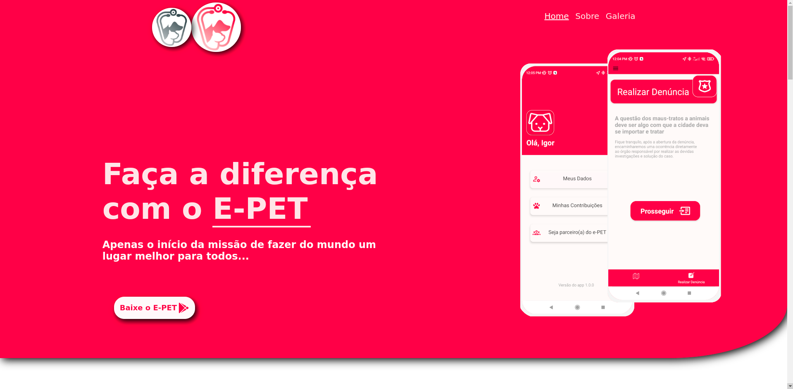
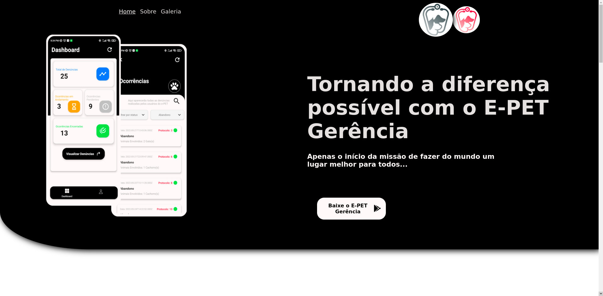
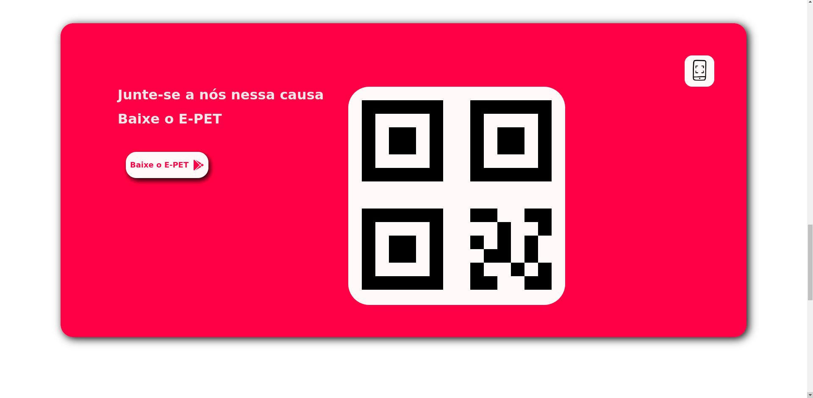
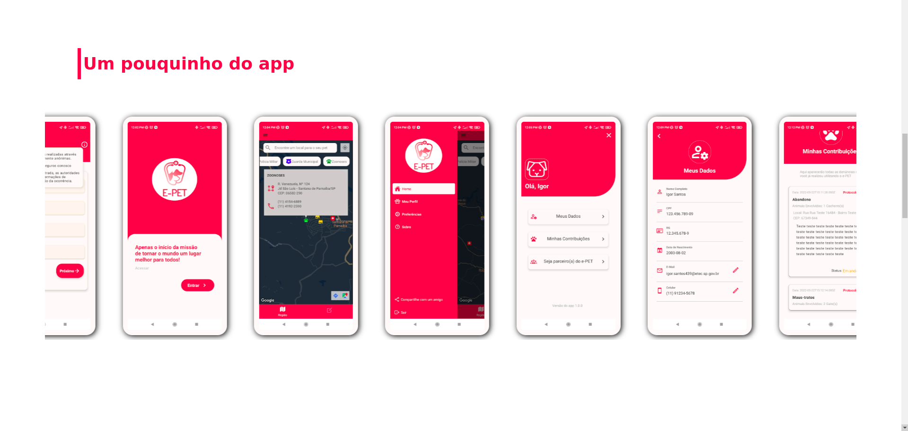
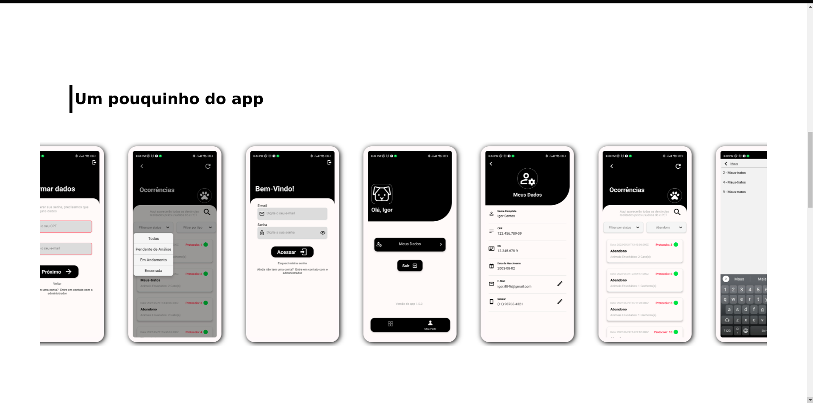
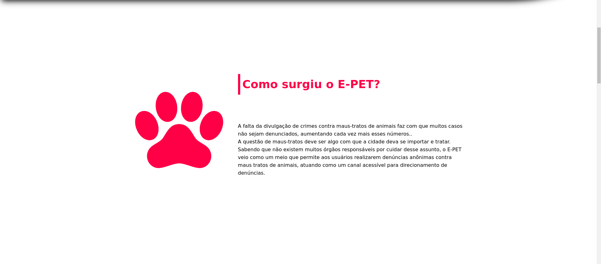
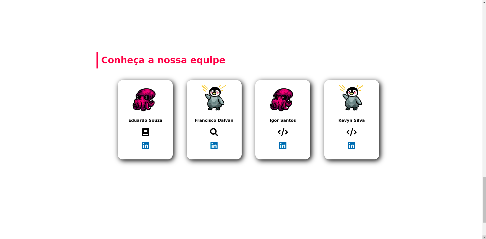
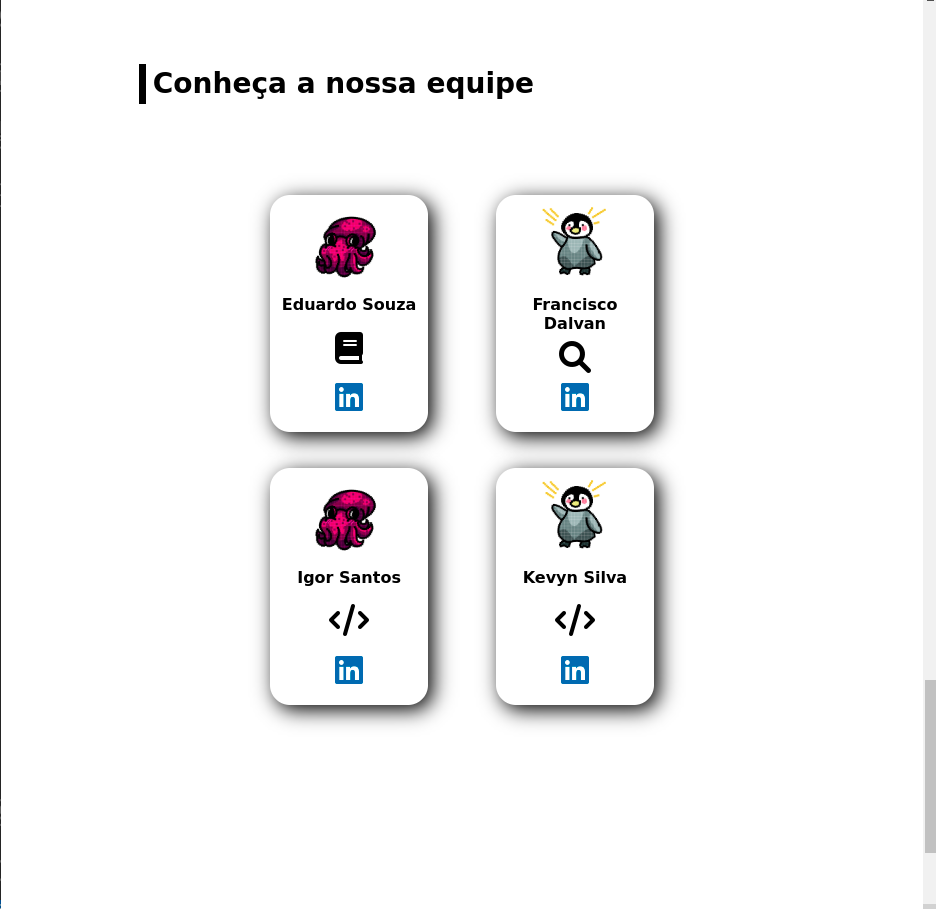
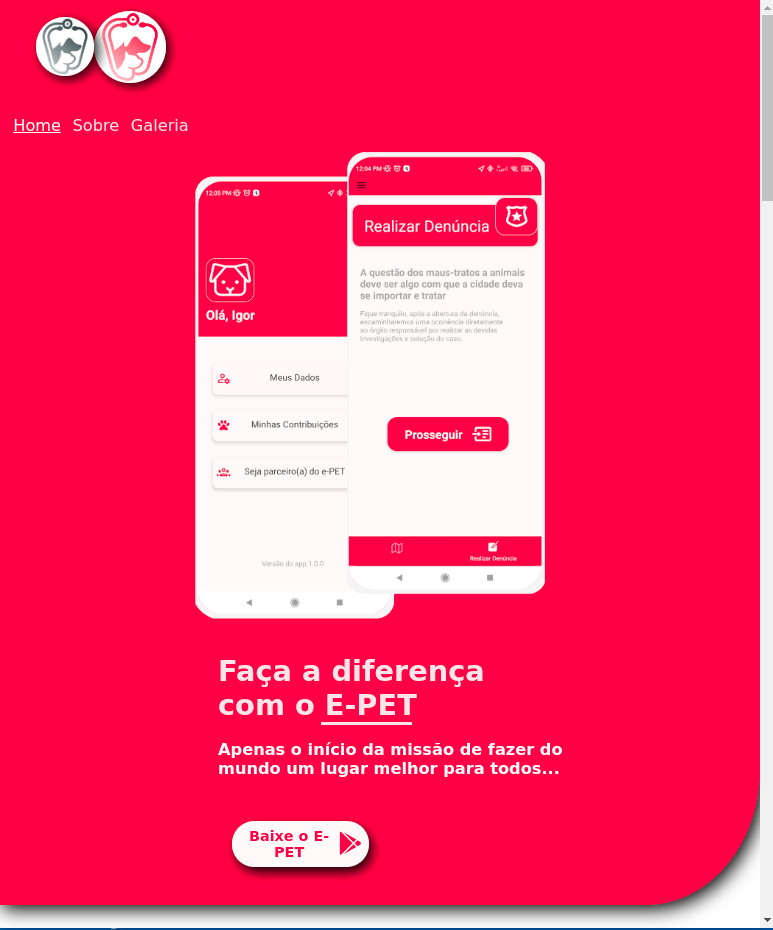
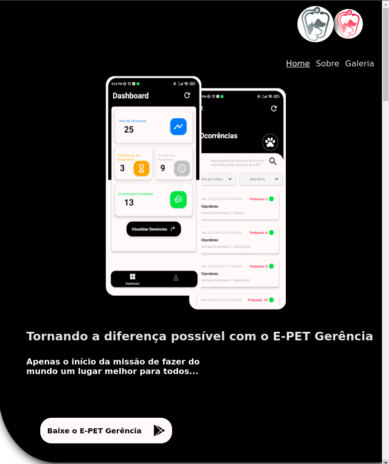

# E-PET Landing Page
Primeiro protótipo de landing page dos apps "E-PET" e "E-PET Gerência", projetos de TCC desenvolvidos na Etec Professora Ermelinda Giannini Teixeira, em 2022 por um time de quatro pessoas:
<a href="https://www.linkedin.com/in/eduardo-monteiro-06454a111/">Eduardo Monteiro</a>,
<a href="https://www.linkedin.com/in/francisco-dalvan-827988169/">Francisco Dalvan</a>,
<a href="https://www.linkedin.com/in/igor-santos-a67301229/">Igor Santos</a> e 
<a href="https://www.linkedin.com/in/kevyn-claudinei-ferreira-da-silva-9a8497211/">Kevyn Silva</a>

